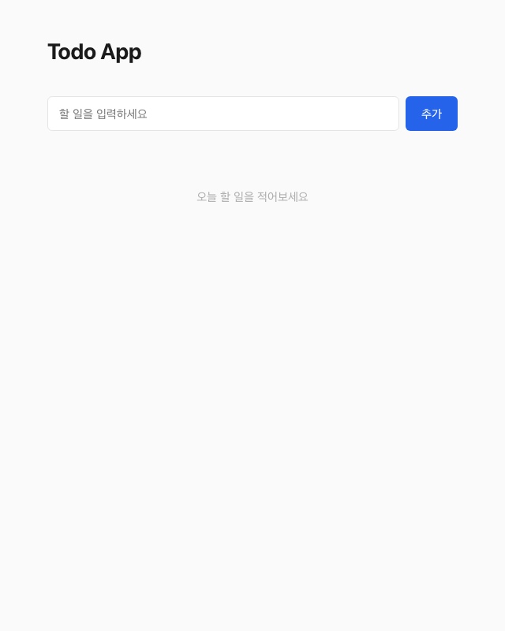
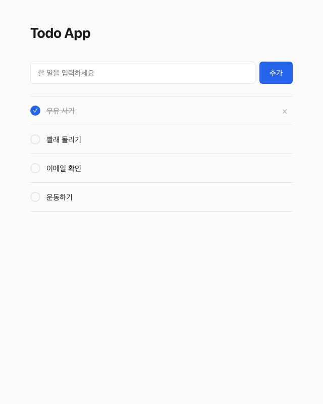
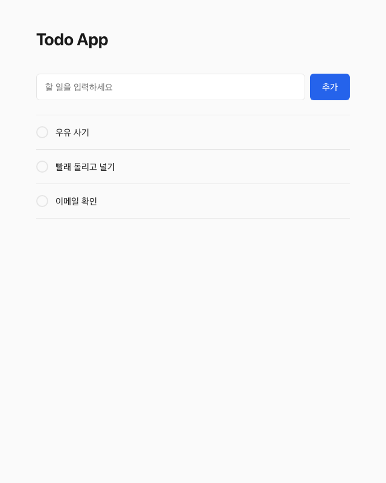

# My Todo App

> FastAPI + SQLite 기반의 미니멀 할 일 관리 웹 앱

## 스크린샷

| 빈 상태 | 할 일 목록 | 완료 상태 |
|---|---|---|
|  |  |  |

| 인라인 편집 | 삭제 | 빈 입력 거부 |
|---|---|---|
|  |  |  |

## 주요 기능

- 할 일 추가 (Enter/버튼, 빈 입력 방지 + shake 애니메이션)
- 할 일 목록 조회 (빈 상태/로딩/에러 처리)
- 완료/미완료 토글 (Optimistic Update + 서버 실패 시 롤백)
- 삭제 (hover 시 버튼 노출, fade-out 애니메이션)
- 인라인 편집 (더블클릭, Enter 저장, Esc 취소)

## 기술 스택

| 구분 | 기술 |
|---|---|
| Backend | FastAPI, Python 3.12 |
| Frontend | HTML, Vanilla JS, Bootstrap 5 |
| Database | SQLite (aiosqlite) |
| Package Manager | uv |
| CI | GitHub Actions |
| 검증 | Playwright MCP |

## 빠른 시작

```bash
git clone https://github.com/researcherhojin/my-todo-app.git
cd my-todo-app
make setup
make dev
# → http://localhost:8000 (포트 사용 중이면 자동으로 8001, 8002로 전환)
```

## 테스트

```bash
make test
```

## 프로젝트 구조

```
my-todo-app/
├── app/
│   ├── main.py          # FastAPI 엔트리포인트
│   ├── database.py      # SQLite CRUD (유일한 DB 접근 모듈)
│   ├── models.py        # Pydantic 모델
│   ├── routers/
│   │   └── todos.py     # /api/todos 라우터
│   ├── templates/
│   │   └── index.html   # 메인 페이지
│   └── static/
│       ├── css/style.css
│       └── js/app.js
├── tests/
│   └── test_todos.py
├── docs/
│   ├── STRATEGY.md      # 전략 정의서
│   └── screenshots/     # Playwright 캡처
├── CLAUDE.md            # AI 에이전트 규칙
├── Makefile
└── pyproject.toml
```

## API

| Method | Endpoint | 설명 | 상태 코드 |
|---|---|---|---|
| GET | /api/todos/ | 전체 목록 조회 | 200 |
| POST | /api/todos/ | 할 일 추가 | 201 |
| PATCH | /api/todos/{id} | 수정/완료 토글 | 200 |
| DELETE | /api/todos/{id} | 삭제 | 204 |

## 버전 히스토리

- v0.1.0 — MVP: CRUD + 미니멀 UX
- v0.0.1 — Harness 세팅
